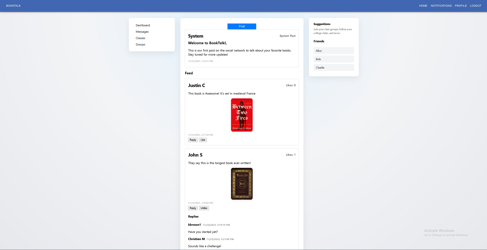
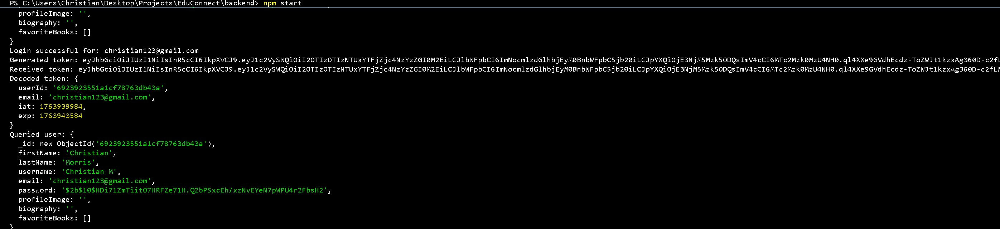
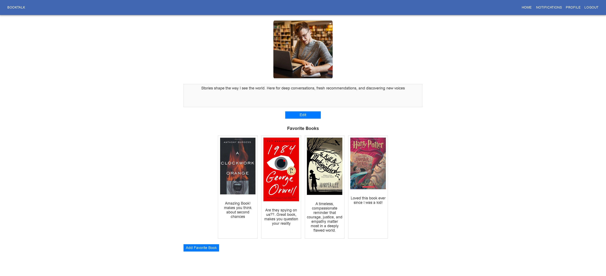
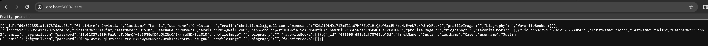

## BookTalk

## Description

BookTalk is a social platform built with React and Express that allows readers to connect through posts, images, favorite books, and personal profiles. Users can register, log in, write posts, upload images, maintain a biography, and curate a collection of books they love. The frontend communicates with a Node/Express backend that handles authentication, CRUD operations, and data storage in MongoDB. Axios calls keep the UI connected to the backend, while React Context manages JWT-based authentication to ensure secure user sessions. The app combines responsive UI design with real database persistence to create a simple, functional reading-focused social experience.

---

## Features

- **Secure Authentication**  
  JWT + bcrypt for registration and login, protected routes, and persistent sessions.

- **Dynamic Home Feed**  
  Users can create posts with text or images, like posts, and reply through a threaded comment system.

- **Profile Customization**  
  Update biography, upload a profile photo, and showcase a library of favorite books.

- **Book Cards**  
  Each favorite book includes a cover image and a personal review stored in the user document.

- **MongoDB Storage**  
  All users, posts, replies, favorites, and images are stored in structured MongoDB documents.

- **Responsive React Frontend**  
  Clean navigation, organized layout for posts, sidebar, rightbar, and a modern profile page.

- **Axios CRUD Communication**  
  The frontend retrieves and updates user/post data through Axios calls directly into Express endpoints.

---

## Preview

## Home Page

The Home page serves as the central feed where users see system posts and user-generated posts sorted from newest to oldest. Each post includes content, optional images, timestamps, likes, and threaded replies. React manages feed state, while Axios loads posts from MongoDB through Express. The navigation bar at the top provides access to Home, Notifications, Profile, and Logout.

  

## Login

The Login page verifies credentials through a secure backend route. If successful, the server returns a signed JWT which is stored in React Context for all protected API calls.

  

## Login Attempts

This screenshot shows a successful login, where valid credentials were entered and the server returned a signed JWT. The frontend stored the token in React Context, granting the user authenticated access to the Home page and all protected routes.

  

## Registration

The Registration page collects first name, last name, email, username, and password. The backend hashes the password with bcrypt, stores the user in MongoDB, and enables immediate login.

  

## Profile

The Profile page lets users upload a profile image, edit their biography, and add favorite books. Book cards contain a user-uploaded cover and a personal review. All data persists in MongoDB and is loaded through secure authenticated routes.

  

## Server Output

The server displays JWT decoding, user document retrieval, and various backend events as the application handles authentication, CRUD operations, and updates to MongoDB. This helps verify that tokens, middleware, and routing are functioning correctly.

  

